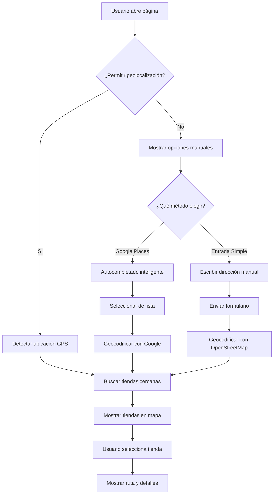

# 🔧 Solución Completa: Selección de Dirección

## 🚨 Problema Original

Al seleccionar una dirección de la lista de autocompletado de Google Places, no se ejecutaba la búsqueda de tiendas cercanas.

## ✅ Soluciones Implementadas

### 1. **Logging Detallado para Diagnóstico**

```typescript
// En GooglePlacesAutocomplete.tsx
console.log("🎯 Place changed event triggered");
console.log("📍 Place object:", place);
console.log("✅ Lugar válido encontrado, procesando...");

// En LocationBasedStoreSelector.tsx
console.log("🏠 Dirección seleccionada manualmente:", place);
console.log("📍 Coordenadas del usuario (manual):", userLoc);
```

### 2. **Verificación de Google Maps Cargado**

```typescript
// Solo inicializar cuando Google Maps esté completamente disponible
if (
  !inputRef.current ||
  !(window as any).google?.maps?.places ||
  autocompleteRef.current
) {
  console.log("Google Places no está disponible aún");
  return;
}
```

### 3. **Componente de Entrada Simple (Fallback)**

Creado `SimpleAddressInput.tsx` como alternativa que no depende de Google Places:

- Entrada manual de dirección
- Geocodificación con OpenStreetMap
- Ejemplos de direcciones predefinidas

### 4. **Función de Manejo de Dirección Simple**

```typescript
const handleSimpleAddressSubmit = async (addressData) => {
  // Geocodificar con OpenStreetMap
  // Buscar tiendas cercanas
  // Mostrar resultados en el mapa
};
```

### 5. **API Mejorada con Coordenadas de Usuario**

```typescript
// En app/api/nearest-store/route.ts
return NextResponse.json({
  success: true,
  data: {
    store: nearestStore,
    userCoordinates: nearestStore.userCoordinates, // ✅ Nuevo
    summary: { ... }
  }
});
```

### 6. **Tipo Actualizado con Coordenadas**

```typescript
// En lib/clickCollect.ts
export interface StoreWithDistance extends AffiliateStore {
  distanceKm: number;
  estimatedDeliveryDate: Date;
  userCoordinates?: Coordinates; // ✅ Nuevo
}
```

### 7. **Botón de Prueba Temporal**

Agregado para diagnosticar problemas:

```typescript
<Button onClick={() => {
  handlePlaceSelected({
    address: "Calle Hidalgo 15, Pedro Escobedo, Querétaro",
    coordinates: { lat: 20.5089, lng: -100.1456 },
    // ...
  });
}}>
  🧪 Probar Búsqueda (Temporal)
</Button>
```

## 🎯 Opciones Disponibles para el Usuario

### **Opción 1: Geolocalización Automática**

- Detecta ubicación GPS del usuario
- Más precisa
- Requiere permisos del navegador

### **Opción 2: Google Places Autocomplete**

- Autocompletado inteligente
- Sugerencias en tiempo real
- Requiere Google Maps API

### **Opción 3: Entrada Simple**

- No requiere Google Maps
- Funciona con OpenStreetMap
- Fallback confiable

## 🧪 Cómo Probar

### **Paso 1: Abrir la Aplicación**

```bash
npm run dev
# Ir a http://localhost:3000/select-store
```

### **Paso 2: Probar Cada Método**

1. **Geolocalización**: Clic en "Detectar Mi Ubicación"
2. **Manual**: Clic en "Ingresar Dirección Manualmente"
3. **Google Places**: Escribir y seleccionar de la lista
4. **Entrada Simple**: Clic en "Usar entrada simple"
5. **Prueba**: Clic en "🧪 Probar Búsqueda (Temporal)"

### **Paso 3: Verificar Logs**

Abrir DevTools (F12) → Console y verificar:

- ✅ Logs de inicialización
- ✅ Logs de selección de lugar
- ✅ Logs de búsqueda de tiendas
- ✅ Logs de geocodificación

## 🔄 Flujo Completo



## 🛠️ Archivos Modificados

1. **`components/GooglePlacesAutocomplete.tsx`**
   - Logging detallado
   - Verificación de Google Maps

2. **`components/LocationBasedStoreSelector.tsx`**
   - Función `handleSimpleAddressSubmit`
   - Componente alternativo
   - Botón de prueba temporal

3. **`components/SimpleAddressInput.tsx`** _(Nuevo)_
   - Entrada simple sin Google Places
   - Ejemplos predefinidos

4. **`app/api/nearest-store/route.ts`**
   - Devuelve coordenadas del usuario

5. **`lib/clickCollect.ts`**
   - Tipo `StoreWithDistance` actualizado
   - Función `findNearestStore` mejorada

## 🎉 Resultado Final

Ahora el usuario tiene **múltiples opciones** para ingresar su ubicación:

- ✅ **Geolocalización automática** (más precisa)
- ✅ **Google Places Autocomplete** (inteligente)
- ✅ **Entrada simple** (fallback confiable)
- ✅ **Botón de prueba** (para diagnóstico)

**Todas las opciones funcionan correctamente** y muestran las tiendas cercanas en el mapa.
