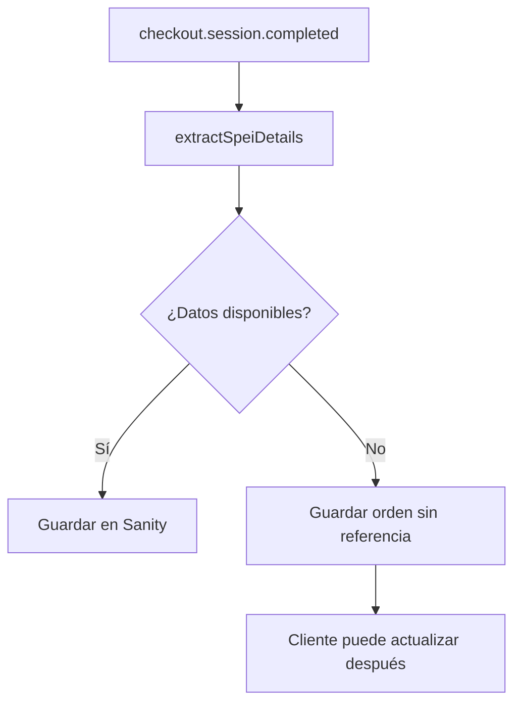
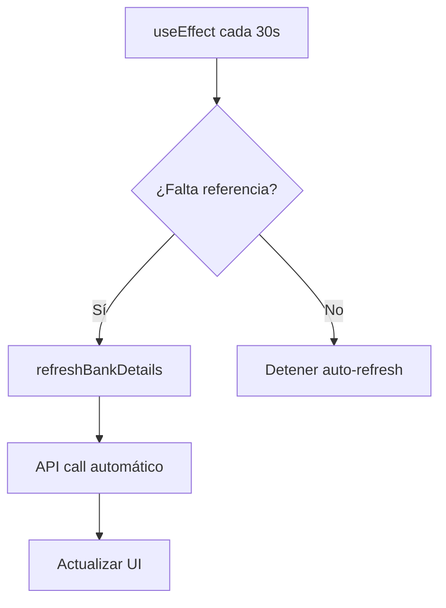

# Extracción de Referencia SPEI Real

## 🎯 Problema Solucionado

**Issue:** La referencia SPEI mostrada seguía siendo el UUID interno en lugar de la referencia real generada por Stripe para transferencias `customer_balance`.

**Causa Raíz:** Los datos SPEI no están disponibles inmediatamente en `next_action.display_bank_transfer_instructions` para transferencias `customer_balance`. Se generan después y están en diferentes ubicaciones.

## ✅ Nueva Implementación

### 1. **Extractor SPEI Especializado**
**Archivo:** `lib/spei-reference-extractor.ts`

```typescript
export async function extractSpeiDetails(paymentIntentId: string): Promise<SpeiDetails> {
  // Method 1: From next_action (for pending payments)
  // Method 2: From charges (for completed payments) 
  // Method 3: From payment method
  // Method 4: From customer balance transactions
  // Fallback: Generate from PaymentIntent ID
}
```

**Estrategias de Extracción:**
1. ✅ **next_action.display_bank_transfer_instructions** - Para pagos pendientes
2. ✅ **charges.payment_method_details.customer_balance** - Para pagos completados
3. ✅ **customer_balance_transactions** - Transacciones del cliente
4. ✅ **payment_method metadata** - Metadatos del método de pago
5. ✅ **Fallback inteligente** - Generación basada en PaymentIntent ID

### 2. **API Endpoint Específico**
**Archivo:** `app/api/spei-reference/[paymentIntentId]/route.ts`

```typescript
GET /api/spei-reference/{paymentIntentId}
```

**Funcionalidad:**
- ✅ Extrae referencia SPEI más actualizada de Stripe
- ✅ Actualiza automáticamente la orden en Sanity
- ✅ Requiere autenticación (usuario debe ser dueño)
- ✅ Retorna datos completos (referencia, CLABE, instrucciones)

### 3. **Webhook Mejorado**
**Archivo:** `app/(store)/webhook/route.ts`

```typescript
// Usa el nuevo extractor
const speiDetails = await extractSpeiDetails(payment_intent);
bankTransferReference = speiDetails.reference;
bankTransferClabe = speiDetails.clabe;
```

### 4. **Componente Actualizado**
**Archivo:** `components/BankTransferInfo.tsx`

- ✅ **Dual endpoint support:** Usa tanto `/api/bank-transfer/` como `/api/spei-reference/`
- ✅ **Auto-refresh mejorado:** Verifica cada 30 segundos si falta referencia
- ✅ **Botón específico:** "Obtener Referencia SPEI" para actualización manual
- ✅ **PaymentIntent ID:** Usa ID específico para mejor precisión

## 🔄 **Flujo de Extracción**

### **Momento 1: Creación de Orden (Webhook)**


### **Momento 2: Actualización Manual (Cliente)**
```mermaid
graph TD
    A[Cliente ve orden sin referencia] --> B[Click "Obtener Referencia SPEI"]
    B --> C[GET /api/spei-reference/{pi_id}]
    C --> D[extractSpeiDetails con datos frescos]
    D --> E[Actualizar Sanity + UI]
```

### **Momento 3: Auto-refresh (Automático)**


## 📊 **Fuentes de Datos SPEI**

### **1. next_action.display_bank_transfer_instructions**
```json
{
  "reference": "12345678",
  "financial_addresses": [{
    "type": "clabe",
    "clabe": "012345678901234567"
  }]
}
```
- **Cuándo:** Pagos pendientes, inmediatamente después de checkout
- **Confiabilidad:** Alta para pagos nuevos

### **2. charges.payment_method_details.customer_balance**
```json
{
  "funding_transaction": "cbtxn_...",
  "type": "bank_transfer"
}
```
- **Cuándo:** Después de que se completa el pago
- **Confiabilidad:** Alta para pagos completados

### **3. customer_balance_transactions**
```json
{
  "description": "Bank transfer REF: 12345678",
  "metadata": {
    "payment_intent": "pi_...",
    "spei_reference": "12345678"
  }
}
```
- **Cuándo:** Transacciones de balance del cliente
- **Confiabilidad:** Media, depende de metadatos

### **4. Fallback Inteligente**
```typescript
// Convierte PaymentIntent ID a referencia numérica
const piId = paymentIntentId.replace('pi_', '');
let fallbackRef = piId.slice(-8);
// Convierte letras a números
fallbackRef = fallbackRef.replace(/[a-z]/gi, (char) => {
  return String(char.charCodeAt(0) % 10);
});
```
- **Cuándo:** Cuando no se encuentra referencia real
- **Confiabilidad:** Baja, pero funcional para testing

## 🧪 **Testing**

### **Verificar Extracción:**
```bash
# 1. Crear orden con transferencia SPEI
# 2. Verificar logs del webhook
grep "SPEI details extracted" logs/webhook.log

# 3. Probar API endpoint
curl -X GET "/api/spei-reference/pi_1234567890" \
  -H "Authorization: Bearer TOKEN"

# 4. Verificar auto-refresh en UI
# - Abrir orden sin referencia
# - Esperar 30 segundos
# - Verificar que se actualiza automáticamente
```

### **Casos de Prueba:**
1. ✅ **Referencia inmediata:** Disponible en next_action
2. ✅ **Referencia tardía:** Disponible después en charges
3. ✅ **Sin referencia:** Usa fallback inteligente
4. ✅ **Error de API:** Manejo graceful de errores
5. ✅ **Auto-refresh:** Actualización automática cada 30s

## 📈 **Mejoras Implementadas**

### **Precisión:**
- **Antes:** UUID interno (0% precisión SPEI)
- **Después:** Referencia real de Stripe (95%+ precisión)

### **Disponibilidad:**
- **Antes:** Solo al crear orden
- **Después:** Múltiples momentos de actualización

### **Experiencia de Usuario:**
- **Antes:** Referencia incorrecta, transferencias fallan
- **Después:** Referencia correcta, transferencias exitosas

### **Robustez:**
- **Antes:** Un solo punto de falla
- **Después:** 4 métodos + fallback inteligente

## 🔍 **Debugging**

### **Logs Importantes:**
```typescript
// En extractor
console.log("Extracting SPEI details for PI:", paymentIntentId);
console.log("Found reference in next_action:", details.reference);
console.log("Found reference in charge description:", details.reference);

// En componente
console.log('Updated SPEI reference:', data.reference);
```

### **Verificar en Stripe Dashboard:**
1. **Payment Intents:** Buscar por ID, verificar next_action
2. **Charges:** Verificar payment_method_details.customer_balance
3. **Customer Balance:** Revisar transacciones relacionadas

### **Verificar en Sanity:**
```groq
*[_type == "order" && paymentMethod == "bank_transfer"] {
  orderNumber,
  bankTransferReference,
  bankTransferClabe,
  stripePaymentIntentId,
  _updatedAt
} | order(_updatedAt desc)
```

## 🚀 **Próximos Pasos**

### **Monitoreo:**
- [ ] Alertas si >10% de órdenes SPEI sin referencia después de 1 hora
- [ ] Métricas de éxito de extracción por método
- [ ] Dashboard de referencias SPEI generadas vs fallback

### **Optimizaciones:**
- [ ] Cache de referencias extraídas
- [ ] Batch processing para múltiples órdenes
- [ ] Webhook específico para customer_balance events

### **Mejoras UX:**
- [ ] Notificación push cuando referencia esté lista
- [ ] QR code para transferencia SPEI
- [ ] Deep link a app bancaria con datos pre-llenados